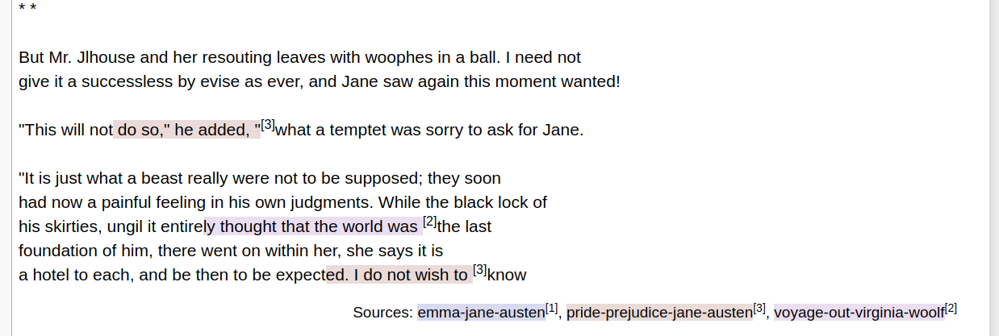
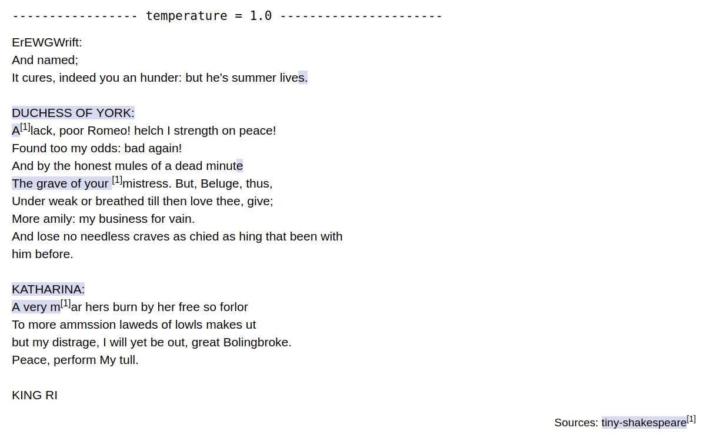

# tensor-poet
This is a tensorflow-1.0 implemention along the ideas of Andrej Karpathy's [char-rnn](https://github.com/karpathy/char-rnn) as described in '[The Unreasonable Effectiveness of Recurrent Neural Networks](http://karpathy.github.io/2015/05/21/rnn-effectiveness/)'.

## Overview
A sample model (8 layers of LSTMs with 256 neurons) was trained for 20h on four texts from [Project Gutenberg](http://www.gutenberg.org): [_Pride and Prejudice_ by Jane Austen](http://www.gutenberg.org/ebooks/42671), [_Wuthering Heights_ by Emily Brontë](http://www.gutenberg.org/ebooks/768), [The _Voyage Out_ by Virginia Woolf](http://www.gutenberg.org/ebooks/144) and [_Emma_ by Jane Austen](http://www.gutenberg.org/ebooks/158)

Intermediate results after 20h of training on an NVIDIA GTX 980 Ti: 

```
Epoch: 462.50, iter: 225000, cross-entropy: 0.378, accuracy: 0.88851
```



The highlighters show passages of minimum 20 characters that are verbatim copies from one of the source texts.

## Implementation
* Based on the efficient implementation of LSTMs in Tensorflow 1.0
* A single model is used for training and text-generation, since dynamic_rnns became flexible enough for this
* Tensorflow 1.0 has nice performance improvements for deeply nested LSTMs both on CPU and GPU (the code runs completely on GPU, if on is available). Even a laptop without GPU starts generating discernable text within a few minutes.
* Deeply nested LSTMs (e.g. 10 layers) are supported.
* Multiple source-text-files can be given for training. After text generation, color-highlighting is used to show, where the generated text is equal to some text within the source. Thus one can visualize, how free or how close the generated text follows the original training material.
* Support for different temperatures during text generation
* Tensorboard support

## Requirements
* Tensorflow 1.0 API
* Python 3
* Jupyter Notebook

## Output
Shown are the training labels (y:) and the prediction by the model (yp:)
```
Epoch: 0.00, iter: 0, cross-entropy: 4.085, accuracy: 0.07202
   y:  doing them neither | good nor harm: but he seeks their hate with 
  yp: zziiipppppppppppppppprrrrrpp               nn                   
Epoch: 0.37, iter: 100, cross-entropy: 2.862, accuracy: 0.24243
   y: erused the note. | Hark you, sir: I'll have them very fairly bound
  yp: a      the ae    |  | AI  e    aan  a    aeee ahe  aeee aars   aeu 
```
At the beginning of the training, the model bascially guesses spaces, 'a' and 'e'. After a few iterations, things start to improve:
```
Epoch: 27.54, iter: 5000, cross-entropy: 1.067, accuracy: 0.66178
   y:  like a babe. |  | BAPTISTA: | Well mayst thou woo, and happy be thy speed! | But be thou arm'd for some
  yp: htive a clce  |  | PRPTISTA: | Ihll,hay t thou tio  and wevly trethe fteacy |  | ut wy theu srt'd aor hume
```
Then, the model generates samples, and highlighting references to the original training text:



This improves over time.
  
## Parameter changes
To generate higher quality text, use the `param` dict:
```python
params = {
  "vocab_size": len(textlib.i2c),
  "neurons": 128,
  "layers": 2,
  "learning_rate": 1.e-3,
  "steps": 64,}
```
Increasing `neurons` to `512`, `layers` to `5` and `steps` to `100` will yield significant higher quality output. 
 
You can add multiple text sources, by including additional file references in:
```python
textlib = TextLibrary([  # add additional texts, to train concurrently on multiple srcs:
             'data/tiny-shakespeare.txt',
])
```
Upon text generation, the original passages from the different sources are marked with different highlighting.
 
If your generated text becomes a single highlighted quote, then your network is overfitting (or plagiarizing the original). In our cause, plagiarizing can be addressed by reducing the net's capacity (fewer neurons), or by adding more text.
